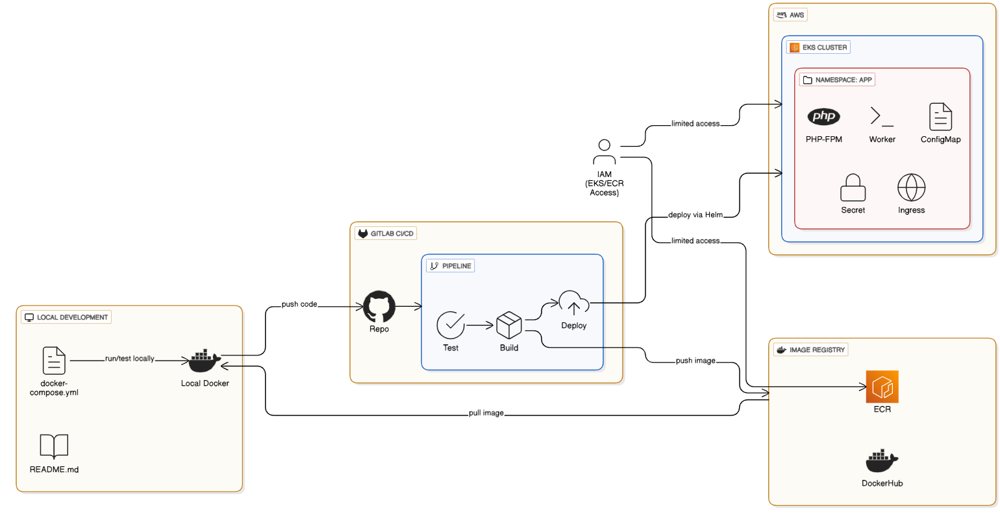

# Laravel 10 Boilerplate - Production DevOps Implementation

<!-- Project README Header -->

<div align="center">
  <h3>Cloud Native Architecture • CI CD • Kubernetes Ready</h3>
</div>

<p align="center">
  <em>
    This repository demonstrates a modern DevOps driven approach to building,
    testing, and deploying a scalable Laravel application using containerization,
    infrastructure as code, and automated delivery pipelines.
  </em>
</p>

<p align="center">
  
  
  
    
  
</p>

<hr />


**Name:**  Emmanuel Michael Ibok
**Email:** ibokemmanuel17@gmail.com


## Architecture Diagram



## Table of Contents

- [Overview](#overview)
- [Project Architecture](#project-architecture)
- [Prerequisites](#prerequisites)
- [Local Development Setup](#local-development-setup)
- [Terraform Infrastructure](#terraform-infrastructure)
- [Helm Chart Deployment](#helm-chart-deployment)
- [CI/CD Pipeline](#cicd-pipeline)
- [Docker Configuration](#docker-configuration)
- [Security Considerations](#security-considerations)
- [Troubleshooting](#troubleshooting)

## Overview

This project implements a production ready DevOps pipeline for a Laravel 10 application.

Key capabilities include:

- Infrastructure as Code using Terraform
- AWS EKS Kubernetes cluster
- Multi stage Docker builds
- Helm based Kubernetes deployments
- GitLab CI CD with gated production releases
- Development, Staging, and Production environments
- Separate PHP FPM and Queue Worker deployments

---

## Project Architecture

### Infrastructure Overview

AWS VPC with public and private subnets across three availability zones.  
EKS nodes run only in private subnets.  
Docker images are stored in dockerhub registry.

### Kubernetes Application Layout

- Ingress with TLS termination
- ClusterIP service
- PHP FPM deployment with horizontal scaling
- Queue worker deployment with independent scaling
- ConfigMaps for configuration
- Secrets for sensitive values

---

## Prerequisites

### Required Tools

- AWS CLI v2
- Terraform v1.x
- Docker v20+
- kubectl v1.28+
- Helm v3
- Git

### Accounts and Access

- AWS account with EKS, VPC, IAM permissions
- GitLab account
- GitLab Runner configured for the project

---

## Terraform Modules Usage

### Project Structure
```bash
laravel-10-boilerplate-infra-task/
├── environments/
│ ├── dev/
│ ├── staging/
│ └── production/
└── modules/
├── vpc/
├── security-group/
├── eks/
└── rds/
```

### Modules Design

Terraform modules are located under the `modules/` directory and are designed to be reusable across environments.

- **vpc**  
  Creates networking components including VPC, subnets, route tables, and gateways.

- **security-group**  
  Manages security groups and ingress egress rules.

- **eks**  
  Provisions the Kubernetes cluster, node groups, IAM roles, and required addons.

- **rds**  
  Creates and manages the relational database instance and related networking resources.

Modules are environment independent and receive configuration through input variables.

### Environment Configuration

Each environment (`dev`, `staging`, `production`) contains its own Terraform configuration:

- `main.tf` for module instantiation
- `variables.tf` for variable definitions
- `terraform.tfvars` for environment specific values
- `providers.tf` and `versions.tf` for provider configuration
- `outputs.tf` for exported outputs

Each environment maintains an isolated Terraform state and can be deployed independently.

---

## Helm Chart Structure and Usage

### Helm Chart Overview

The Helm chart located under `helm-chart/laravel-app` is responsible for deploying the Laravel application to Kubernetes in a production ready manner.

It follows standard Helm best practices and separates concerns between application runtime, configuration, scaling, and networking.

### Directory Structure
```bash
helm-chart/laravel-app/
├── Chart.yaml
├── values.yaml
└── templates/
├── _helpers.tpl
├── configmap.yaml
├── secret.yaml
├── service.yaml
├── ingress.yaml
├── deployment-phpfpm.yaml
├── deployment-worker.yaml
├── hpa-phpfpm.yaml
└── hpa-worker.yaml
```


---

### Chart Components

#### Chart.yaml

Defines Helm chart metadata such as:
- Chart name
- Version
- Application version
- Description

This file must be updated whenever the chart is versioned.

---

#### values.yaml

Holds all configurable values for the chart, including:
- Image repository and tag
- Resource requests and limits
- Environment variables
- Ingress configuration
- Autoscaling parameters

Environment specific overrides should be provided at deployment time rather than modifying templates directly.

---

### Templates Breakdown

#### _helpers.tpl

Contains reusable Helm template helpers such as:
- Naming conventions
- Labels and selectors
- Common annotations

This file helps keep templates consistent and DRY.

---

#### configmap.yaml

Defines non sensitive application configuration, including:
- Application environment variables
- Feature flags
- Runtime configuration

Values are sourced from `values.yaml`.

---

#### secret.yaml

Manages sensitive configuration such as:
- Database credentials
- Application secrets
- API keys

Secrets should be injected securely via CI/CD and never hardcoded.

---

#### deployment-phpfpm.yaml

Defines the main Laravel PHP FPM deployment:
- Application container
- Resource limits
- Health probes
- ConfigMap and Secret injection

This deployment serves web traffic through the service and ingress.

---

#### deployment-worker.yaml

Defines a separate deployment for background workers:
- Executes `php artisan queue:work`
- Scales independently from the web application
- Shares configuration with PHP FPM where applicable

This separation allows independent scaling and fault isolation.

---

#### hpa-phpfpm.yaml

Configures Horizontal Pod Autoscaling for the PHP FPM deployment:
- CPU or memory based scaling
- Minimum and maximum replicas

---

#### hpa-worker.yaml

Configures autoscaling for queue workers:
- Scales based on resource usage
- Prevents worker overload during traffic spikes

---

#### service.yaml

Exposes the PHP FPM deployment internally within the cluster:
- Defines service type
- Maps ports for ingress routing

---

#### ingress.yaml

Manages external access to the application:
- Host based routing
- TLS configuration
- Ingress annotations

Ingress behavior is controlled through `values.yaml`.

---

## Helm Deployment Workflow

Typical deployment flow:

1. CI/CD pipeline updates image tag in Helm values
2. Helm upgrade is executed against the target cluster
3. Kubernetes performs rolling updates
4. Health checks ensure zero downtime deployment

Manual Helm deployments should only be used for troubleshooting.

---

## Design Principles

- Separate deployments for web and workers
- Configuration driven via values.yaml
- Secure handling of secrets
- Autoscaling enabled by default
- Minimal logic inside templates

This Helm chart is designed to be reusable across development, staging, and production environments.


## Local Development Setup

### Clone Repository

```bash
git clone https://gitlab.com/Emmylong1/laravel-10-boilerplate-task.git
cd laravel-10-boilerplate-task

The goal of this project is to serve as a boilerplate for Laravel 10
utilizing light-weight alpine linux images for nginx and php 8.2 (fpm)


Stack:

- app @ php:8.2-fpm-alpine
- nginx @ nginx:alpine
- mysql @ mysql
- redis @ redis:alpine
- worker-local @ php:8.2-alpine3.16

## TODO

- add a basic, highly optional seeder for user
- hook up worker-local so you have a queue to play with
- create an example job/worker you might co-locate on same hardware
- maybe add some ci/cd and even k8s stuff as an example to scale out workers/nginx/edges

## Notes

- docker/app docker/nginx will rely on supervisor to maintain their processes, yawn
- Please see .env "#PORT FORWARDS" before starting in docker-compose
-

## Installation

The default docker-compose config here exposes ports if you want them.  See .env's "PORT FORWARDS"

```shell
cp ./env.example ./.env
docker-compose up --build -d app nginx mysql

#docker-compose exec app php artisan migrate
```

You can now access http://localhost:8022 (or whatever your FORWARD_NGINX_PORT is).

Please keep ./composer.lock in docker/app container context, for example:

```shell
docker-compose exec -u root app /bin/sh
# then...
# COMPOSER_MEMORY_LIMIT=-1 app composer install
# COMPOSER_MEMORY_LIMIT=-1 app composer require awesome/package_etc
# ymmv w/ COMPOSER_MEMORY_LIMIT maybe try without
```
